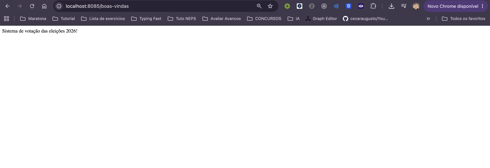
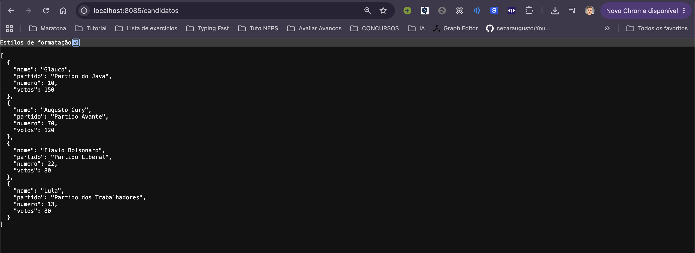

# Sistema de Votação

API REST desenvolvida com Java 25 e Spring Boot para listar candidatos de uma votação.

## Como executar

```bash
mvn spring-boot:run
```
A aplicação utiliza a porta 8085.

## Rotas

1. `/boas-vindas`: mensagem de apresentação.
2. `/destaque`: retorna um candidato em JSON.
3. `/candidatos`: retorna todos os candidatos em JSON.

## Screenshots

### Boas-vindas



### Candidato em destaque


### Lista de candidatos




Perguntas do desafio

Quem criou o controller?
O Spring, durante a inicialização da aplicação.

Como os objetos viram JSON?
O Spring converte automaticamente os objetos Java em JSON.
